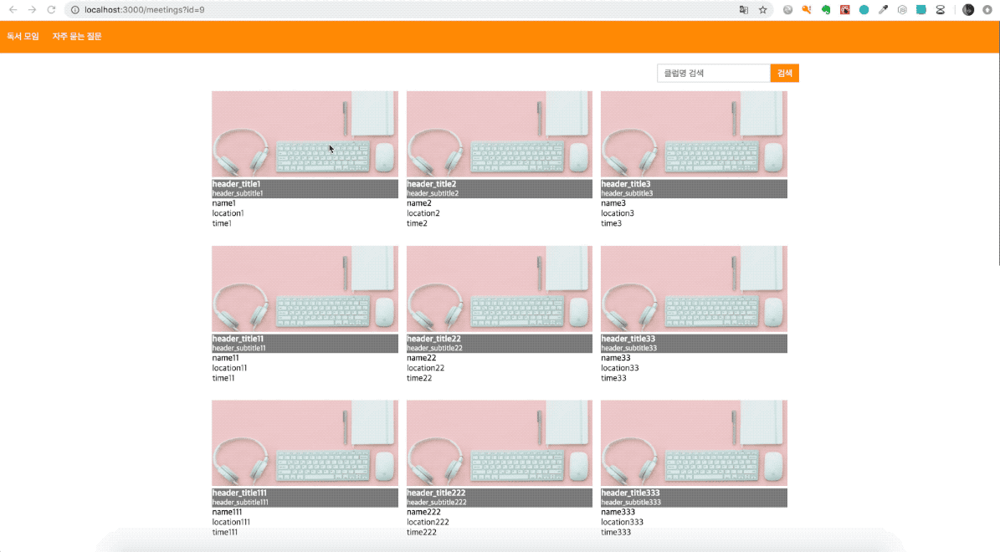
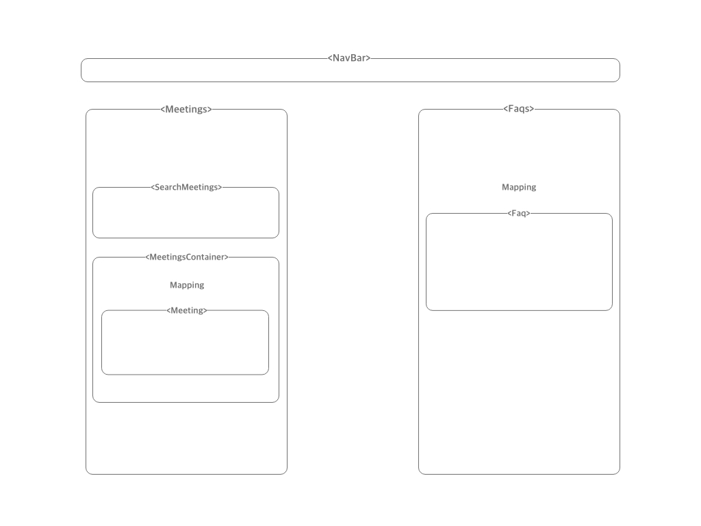
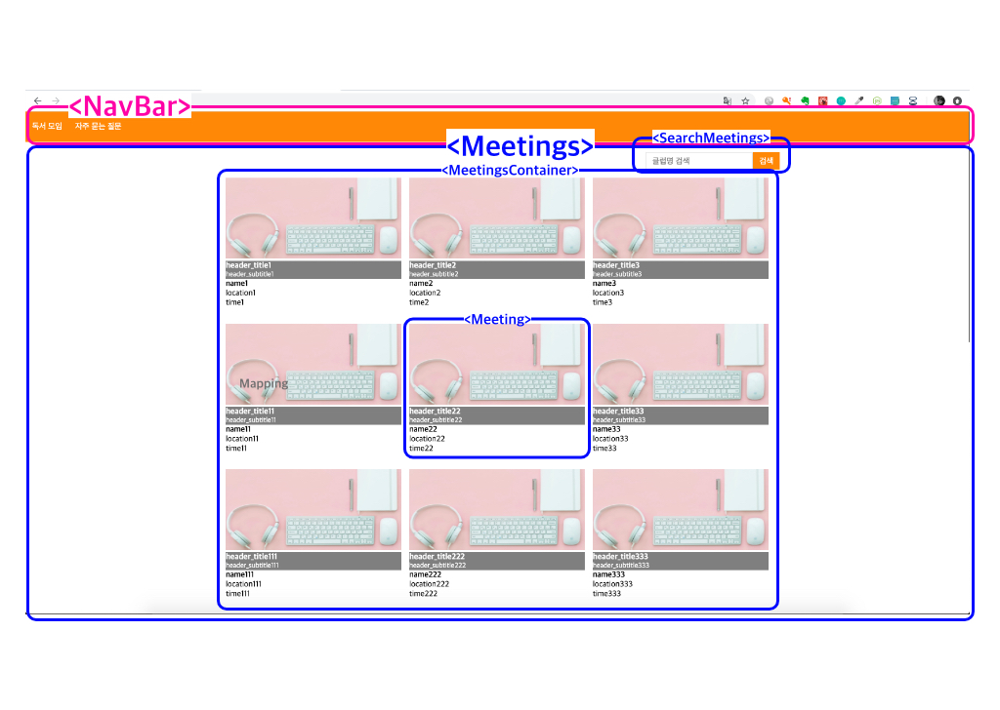
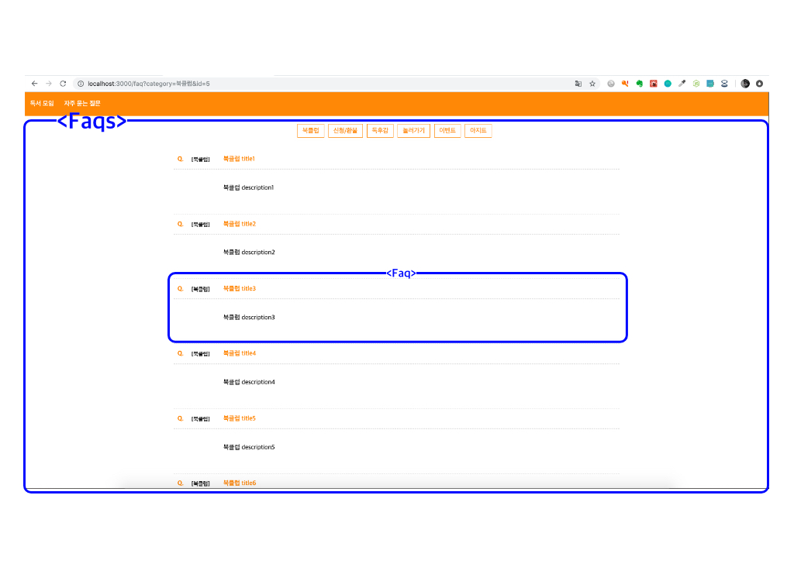

# Meetings&Cs page

## Web page

## Technical Stack

1. React.js
2. React-router
3. Node.js

## Features

1. 마우스 스크롤 업/다운에 따라 헤더가 사라진다.
2. 각 Meeting이미지를 누를때 query로 해당 Meeting의 id를 넘겨준다.
3. Meetings 페이지에서 Meeting을 검색할 수 있다.
4. Cs 페이지에서 카테고리 별로 서로 다른 data를 보여준다.
5. 카테고리 안에서 타이틀을 누르면 정보가 나오고 한번 더 누르면 사라진다.
6. Cs 페이지에서도 마우스 스크롤 업/다운에 따라 헤더가 사라진다.

## Components Structure

